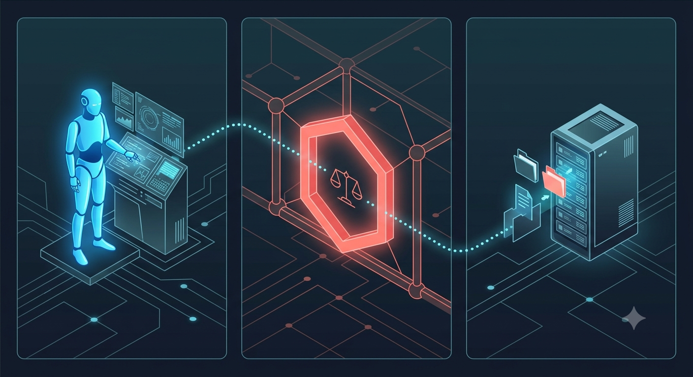

<p align="center">
  
</p>

# 🛡️ ClawGuard

**The firewall for personal AI agents.** A default-deny action broker that sits between your agent (OpenClaw, Hermes, …) and your machine — tap-to-approve anything risky from your phone via Telegram or WhatsApp, and keep a tamper-evident audit log of everything the agent did.

> OpenClaw shipped 138+ CVEs in its first months and its skill registry hosted 1,400+ confirmed malicious skills. Microsoft's guidance is to not run it on a personal machine at all. The agents aren't going away — the missing piece is the control layer. That's ClawGuard.

## How it works

<p align="center">
  
</p>

1. A thin plugin inside the agent forwards every tool call to the ClawGuard daemon on `127.0.0.1`.
2. The policy engine evaluates it: `hard_deny` → blocked instantly, `allow` → flows, everything else → **asks a human** on Telegram, WhatsApp, or the console, and auto-denies on timeout.
3. Every request and decision lands in an append-only, SHA-256 hash-chained audit log — edit one line and verification breaks.

Every action gets exactly one of three verdicts:

<p align="center">
  
</p>

## Security model (the anti-OpenClaw)

- **Default-deny.** Unmatched actions can only `ask` or `deny` — the config format cannot express "allow by default".
- **Fail-closed.** Daemon unreachable? Tool call blocked. Timeout? Denied. No decision path ever ends in silent approval.
- **No inbound exposure.** The daemon binds loopback only. Telegram is long-polled outbound; WhatsApp replies arrive via an outbound-polling relay. Your machine opens zero public ports.
- **Auth mandatory.** Every API call needs a bearer token; there is no "disable auth" flag.
- **Approver allowlist.** Only configured Telegram user ids / phone numbers can decide, and `hard_deny` actions can't be approved by anyone — including you at 2am.
- **Self-protection.** The example policy hard-denies the agent touching `policy.yaml` or ClawGuard itself.
- **Secrets stay off-screen.** Config lives in a gitignored `.env`, and the daemon masks its API token in startup output — logs and screen recordings stay safe to share.

See [SECURITY.md](SECURITY.md) for the full threat model, including an explicit list of what ClawGuard does **not** protect against.

## Quick start

```bash
npm install
copy policy.example.yaml policy.yaml   # then edit paths/commands for your machine
copy .env.example .env                 # then put your secrets in .env (gitignored)
npm test
npm start                              # daemon on 127.0.0.1:4747, console approvals on
```

Secrets live in `.env` (read natively by Node, never committed) so you never type
a token into a terminal you might be screen-recording. The daemon also masks its
API token in startup output by default.

> **Start order matters:** start the ClawGuard daemon **before** your agent. The plugins fail closed — if the daemon isn't running, **every tool call is blocked** ("ClawGuard unreachable — failing closed"). That's the firewall doing its job, but if you didn't know, it looks like your agent broke. Daemon first, agent second. No token plumbing needed: the daemon publishes its token to `~/.clawguard/token` and the plugins pick it up automatically.

Then connect your agent — both plugins talk to the same daemon, and one policy governs them all:

- **OpenClaw:** `openclaw plugins install ./integrations/openclaw`, then restart the gateway. See [its README](integrations/openclaw/README.md) for verification steps and gotchas.
- **Hermes Agent:** copy [`integrations/hermes/`](integrations/hermes/) to `~/.hermes/plugins/clawguard/` — it hooks `pre_tool_call` to gate execution *and* reports executed calls back, so the audit log exposes any tool call that bypassed the check (**bypass detection**). See its [README](integrations/hermes/README.md).
- **Anything else:** the daemon is agent-agnostic — `POST /v1/check {agent, tool, params}`, act only on `"allow"`. An adapter is ~50 lines.

### No plugin at all — proxy mode (experimental)

Some agents have no plugin API, or you'd rather not install one. Point the agent's LLM base URL at ClawGuard instead: it sits between the agent and the model provider, reads the tool calls out of every model response, and runs them through the same policy before the agent ever sees them.

```bash
# .env
CLAWGUARD_PROXY_UPSTREAM=https://api.openai.com   # or any OpenAI/Anthropic-compatible endpoint
```

Then set your agent's base URL to `http://127.0.0.1:4750` and keep using your own API key — it passes straight through and ClawGuard never stores it. Speaks **OpenAI chat-completions** (`tool_calls`) and **Anthropic Messages** (`tool_use`). If any call in a response is denied, the whole response is replaced with a plain explanation, so the agent never receives an instruction it isn't allowed to run. A POST to an endpoint ClawGuard can't gate is refused rather than forwarded — no silent bypass.

**Verified end-to-end against OpenClaw 2026.6.11 with the ClawGuard plugin uninstalled**, using Gemini 2.5 Flash through the proxy:

| Agent turn | ClawGuard | Result |
|---|---|---|
| read `package.json` | `allow` | tool call flows; agent completes the turn and answers normally |
| read `secrets.env` | `hard_deny` at the proxy | agent replies *"ClawGuard blocked 1 tool call(s): read: matched hard_deny rule"* — it never receives the instruction |

Also exercised against local models (Qwen3.5-9B, Gemma4-e4b via Ollama) and both API formats. Every gated call lands in the same hash-chained audit log, tagged `llm-proxy`.

### Approving in a browser

Every pending approval also shows up at **`http://127.0.0.1:4747/ui`** — a zero-dependency page with the pending action, a live auto-deny countdown, and Approve / Deny / Always-allow buttons. Loopback-only, and the daemon rejects any request whose `Host` header isn't localhost, so a malicious website can't reach it via DNS rebinding.

### Phone approvals — pick your channel

**Telegram (recommended — ~3 minutes, zero infrastructure):**

1. Message [@BotFather](https://t.me/BotFather) → `/newbot` → copy the token.
2. Get your numeric user id (message [@userinfobot](https://t.me/userinfobot)).
3. Put both in your `.env` as `TG_BOT_TOKEN` and `TG_APPROVERS`, restart the daemon, then open your bot and send `/start` once (Telegram bots cannot message you first).

Approvals arrive with inline **✅ Approve / ⛔ Deny buttons** — tap to decide. The daemon long-polls Telegram outbound-only: no webhook, no relay, no extra accounts.

**WhatsApp (the flagship — ~25 minutes, self-hosted):** deploy the free relay Worker in [`relay/`](relay/) (full walkthrough in its [README](relay/README.md)), then set `WA_ACCESS_TOKEN`, `WA_PHONE_NUMBER_ID`, `WA_APPROVERS` (comma-separated E.164), `WA_RELAY_URL`, and `WA_RELAY_TOKEN`. Strongly recommended: also set `WA_APPROVER_PINS` so each decision reply must quote a PIN only you know — reply `YES <code> <pin>`, `NO <code> <pin>`, or `ALWAYS <code> <pin>`.

**Console (zero setup):** on by default — approve with `a <code>`, deny with `d <code>`, or `aa <code>` to allow and never ask again for that exact action.

Try it without an agent:

```bash
curl -s -X POST http://127.0.0.1:4747/v1/check \
  -H "Authorization: Bearer $CLAWGUARD_TOKEN" -H "Content-Type: application/json" \
  -d '{"agent":"demo","tool":"exec_shell","params":{"command":"curl https://evil.example"}}'
# → blocks, asks you, or allows — per your policy
```

## Status

`v0.3-dev` (unreleased) adds **proxy mode** — gate any agent with no plugin — and a **browser approval page** at `/ui`, both described above. Both are verified end-to-end: a real OpenClaw agent running on Gemini 2.5 Flash was gated through the proxy with no plugin installed.

`v0.2` — the v0.1 core (policy engine, approval queue, audit chain, HTTP API, console + Telegram + WhatsApp channels, OpenClaw + Hermes plugins) plus:

- **Short approval codes** — every pending request gets a single-use 6-character code (`YES K7M2QF` beats typing a UUID). A code dies with its decision, so a leaked or replayed old approval is worthless.
- **WhatsApp pairing PINs** — set `WA_APPROVER_PINS` and each approver must quote their PIN in every reply; a spoofed or SIM-swapped sender number alone can no longer approve. (Telegram already authorizes by Telegram-assigned numeric user id, which other users cannot spoof.)
- **"Always allow this exact action"** — tap 📌 on Telegram, reply `ALWAYS <code>`, or type `aa <code>` in the console, and that *exact* action (same agent, tool, and parameters — byte-for-byte) stops asking. Anything different still asks, and a `hard_deny` can never be remembered around. Rules live in `data/remembered.json`; delete an entry to revoke.
- **Plugins survive daemon restarts** — on a 401 the plugins re-read `~/.clawguard/token` and retry once, so restarting the daemon no longer strands a running gateway.

The v0.2 additions were exercised against a live daemon: all three verdicts, code-based approval, remembered-allow persistence, timeout auto-deny, and the token refresh for both plugins — the OpenClaw plugin was verified inside a live gateway (agent kept working across a daemon restart that changed the token, and was blocked fail-closed when the daemon was down). The table below is the original v0.1 end-to-end verification.

**Verified end-to-end against OpenClaw 2026.6.11 on native Windows.** All three verdict paths were exercised against a live agent:

| Agent action | ClawGuard | Result |
|---|---|---|
| read `secrets.env` | `hard_deny`, instantly | agent replies *"access to this file has been denied by ClawGuard"* — no approval offered to anyone |
| write `test.txt` | `ask` → Telegram | phone shows *"openclaw wants write …"*; tapping ⛔ records `decidedBy=human`, the file is never created |
| write `test.txt`, ignored | `ask` → timeout | auto-denied after 120s — agent reports *"timed out waiting for human approval"* |

Every request and decision landed in the hash-chained log, which still verifies.

Not yet independently audited; treat it as a second lock, not a vault. See [SECURITY.md](SECURITY.md) for the threat model and [docs/ARCHITECTURE.md](docs/ARCHITECTURE.md) for the design and roadmap (universal LLM-proxy mode for any agent, OS sandbox execution tier, skill scanner).

## What gets protected (not just `.env` files)

ClawGuard protects **whatever your policy says** — secrets are just the loudest example. The mental model is three zones:

1. **`hard_deny` — never, no matter who asks.** The example policy ships with key material (`.env`, SSH keys, cloud credentials) and destructive commands here. Add your own untouchables — financial documents, tax folders, password-manager vaults:

   ```yaml
   - note: financial and identity documents — no agent, ever
     tool: "*"
     path: ["C:/Users/you/Documents/Banking/**", "**/tax-returns/**"]
   ```

2. **`allow` — your explicitly safe zones.** Project folders, safe read-only commands. **Keep these globs narrow** — every path you allow is a path the agent can touch without asking. Don't allow `C:/Users/you/**`; allow `D:/projects/**`.

3. **Everything else — asks a human.** This is the part people miss: your bank statements, hidden files, photos, and random personal folders are protected **by default**, because any action that matches no rule goes to `ask` (or `deny`, if you set it stricter). The agent can't open `Documents\loan-statement.pdf` without your phone buzzing first — not because you wrote a rule for it, but because you *didn't* write one allowing it.

Two honest limits: ClawGuard matches on the **tool call's parameters** (paths, commands, strings) — it doesn't read file contents, so a sensitive file sitting *inside* a folder you allowed will pass that allow rule. And it gates actions routed through the agent's tool layer — the OS-level sandbox tier (roadmap v0.4) is what will enforce boundaries even on a fully compromised agent.

## How attacks get stopped

A prompt-injected email or a malicious skill tells your agent to grab your secrets and send them off. The agent obeys — but the action still has to pass the gate, and key material is hard-denied for every tool:

<p align="center">
  
</p>

## Contributing

Issues and PRs welcome — especially adapters for other agents, and policy rules
worth shipping in the example. For security bugs, do **not** open an issue; see
[SECURITY.md](SECURITY.md).

---

[MIT licensed](LICENSE). Built in public — follow along.
